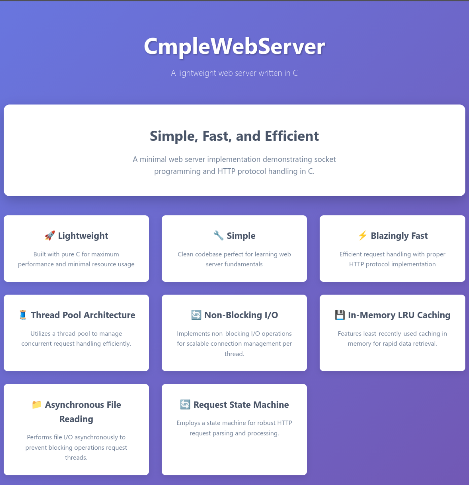

# CmpleWebServer

## Задание на курсовую работу по дисциплине "Компьютерные сети"

Разработать сервер для отдачи статического содержимого с диска по протоколу HTTP:
* Предусмотреть поддержку запросов GET и HEAD, поддержку статусов 200, 403, 404.
* Предусмотреть возможность ответа сервера на неподдерживаемые запросы статусом 405.
* Обеспечить корректную передачу файлов размером до 128 Мбайт.
* Реализовать мультиплексирование - каждый процесс или поток должен отдавать данные по нескольким сетевым соединениям.
* Сервер по умолчанию должен возвращать HTML-страницу на выбранную тему с CSS-стилем.
* Реализовать запись информации о событиях в журнал (лог).
* Учесть минимальные требования к безопасности серверов статического содержимого.

Провести нагрузочное тестирование разработанного сервера:
* Максимальное количество обслуживаемых сетевых соединений
* Скорость отдачи данных по каждому сетевому соединению и совокупная

Варианты архитектуры разрабатываемого сервера:
3. thread pool + pselect()

При использовании в разработке платформы BSD/MacOS следует заменить системный вызов epoll() на kqueue()

Оформление курсовой работы:
1. Расчётно-пояснительная записка на 12-32 листах А4
2. Презентация к курсовой работе на 8-16 слайдах


Вопросы и ответы (на основе опыта защит в предыдущие годы)

**Вопрос:** Какую операционную систему использовать?
Ответ: Систему, в которой есть системные вызовы fork(), select(), pselect(), poll(), epoll(). Это любой современный Линукс и различные системы семейства *BSD (FreeBSD как пример). На Windows вариант с prefork вы реализовать не сможете.

**Вопрос:** На каком языке программирования писать?
Ответ: На языке, который позволяет обращаться к вышеуказанным системным вызовам (с помощью стандартной библиотеки). Это языки C, C++, Swift, Rust. Высокоуровневые фреймворки (вроде SwiftNIO) использовать нельзя. Языки, которые сами по себе высокоуровневый фреймворк (Python, Go) - также использовать нельзя.

**Вопрос:** Какие библиотеки можно использовать?
Ответ: Можно пользоваться стандартной библиотекой соответствующего языка. Если вы нашли какую-либо библиотеку или фреймворк, которые хотите использовать, но у вас есть сомнения - задайте вопрос руководителю по электронной почте. В любом случае - исходный код такой библиотеки должен быть либо включен в дерево исходников вашего проекта (если лицензия позволяет), либо ее подключение должно быть описано в инструкции по сборке проекта.

**Вопрос:** Какие есть материалы по данной теме?
Ответ: Если требуется быстро войти в курс дела, рекомендуется ознакомиться со вторым томом книги А. В. Столярова "Программирование: введение в профессию", выложена в электронном виде по ссылке http://stolyarov.info/books/programming_intro/2_91, вам нужны части 6 и 7.
Еще рекомендуется посмотреть эту статью https://habr.com/ru/companies/infopulse/articles/415259/ и этот мини-проект https://github.com/jamesmacinnes/http-buddy/ Если есть желание углубиться в тему, рекомендую  Michael Kerrisk "The Linux Programming Interface" https://man7.org/tlpi/index.html (pdf есть в Интернете). Также в любом Линуксе по указанным системным вызовам есть отличные man-страницы, с примерами.


## Реализация

### Зависимости

- gcc
- make
- libcheck (для тестирования) https://libcheck.github.io/check/

### Сборка и запуск

```bash
make all && ./main.app
```

### Тестирование

```bash
make test && ./test.app
```

### Cool stuff



